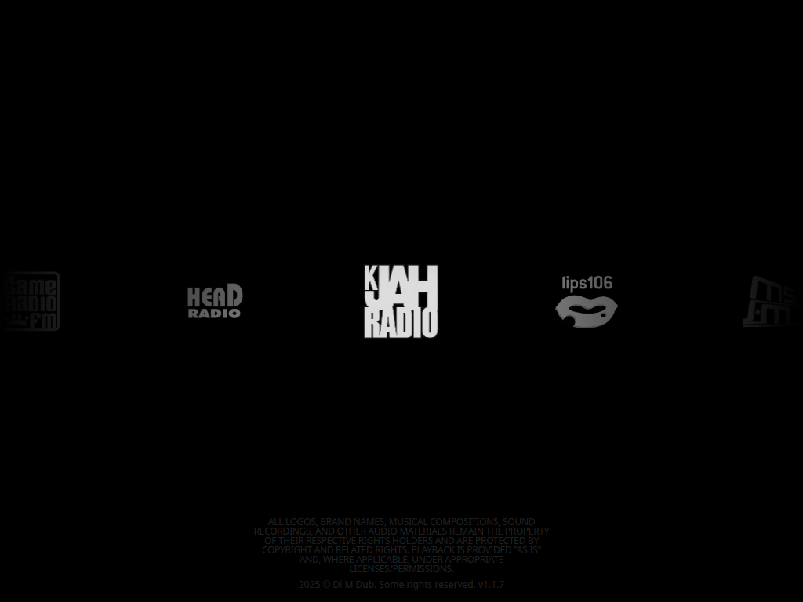

# GTA Radio Online



A static website for easy listening to GTA radio stations. Copy `data.example.json` to `src/data.json` and specify the URLs of your stations and its logos (see `src/cover` folder). You can also get data from your API in format:

```json
[
  {
    "title": "My radio", // str, name
    "file": "https://radio.stream/online", // str, URL
    "logo": "logo.jpg", // str, filename in src/cover
    "game": "Awesome game", // str, additional data
    "id": 0 // int, ID
  },
  ...
]
```

Don't forget to change `dataURL` to yours:

```js
function player() {
    return {
        ...
        dataURL: "https://your.api/data.json",
        ...
    }
});
```

## Docker

```sh
docker compose up -d
```

## Environment variables

Set ot create file `.env`

- **NGINX_HOST** hostname (default: localhost)
- **NGINX_PORT** port (default: 80)

## Disclaimer

All logos, brand names, musical compositions, sound recordings, and other audio materials remain the property
of their respective rights holders and are protected by copyright and related rights. Playback is provided “as is”
and, where applicable, under appropriate licenses/permissions.
